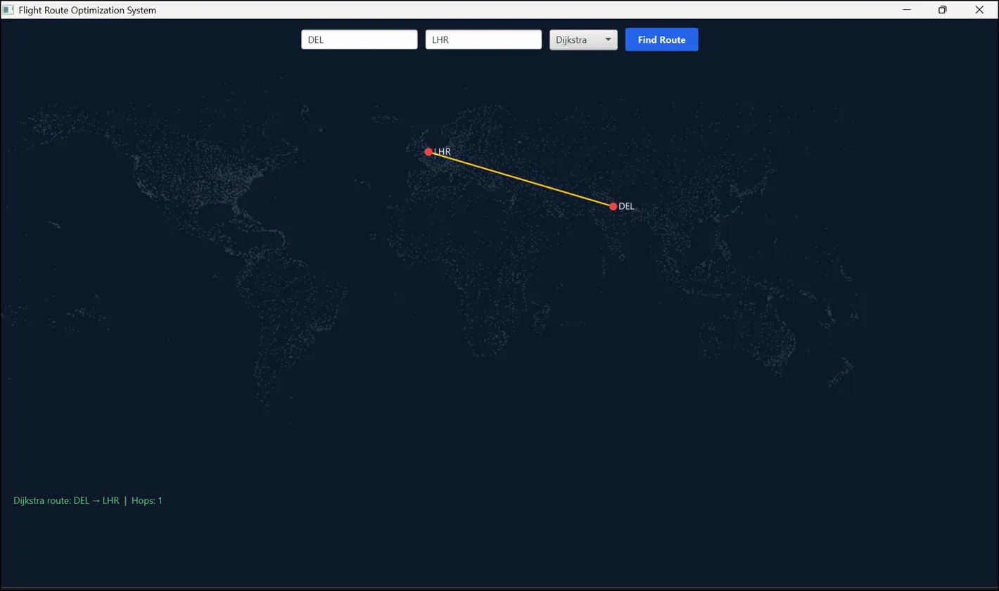

# ✈️ Flight Route Optimization System

A Java-based interactive flight route optimizer that finds optimal paths between **3,000+ real-world airports** using four classic graph algorithms, visualized on a world map via JavaFX.

---

## 🖥️ Demo



---

## 🚀 Features

- 🗺️ Interactive world map with real airport coordinates
- 🔍 Find optimal routes by cost, duration, or hops
- ⚡ Compare 4 algorithms side-by-side
- 🚧 Simulate route disruptions and dynamic re-routing
- 📊 Real OpenFlights dataset (3,000+ airports, 60,000+ routes)

---

## 🧠 Algorithms Implemented

| Algorithm | Use Case | Time Complexity |
|---|---|---|
| **Dijkstra's** | Shortest cost/time path | O((V + E) log V) |
| **Bellman-Ford** | Handles discounts & penalties | O(VE) |
| **Floyd-Warshall** | All-pairs shortest path | O(V³) |
| **A\*** | Heuristic-based fastest routing | O(E log V) |

---

## 🛠️ Tech Stack

| Layer | Technology |
|---|---|
| Language | Java 23 |
| UI | JavaFX 21 |
| Dataset | OpenFlights (airports.dat, routes.dat) |
| IDE | VS Code |

---

## 📁 Project Structure

```
FlightRouteOptimizer/
├── data/
│   ├── airport.dat         # 3,000+ airports with coordinates
│   └── routes.dat          # 60,000+ flight routes
├── src/
│   ├── Main.java           # Entry point
│   ├── algorithms/
│   │   ├── Dijkstra.java
│   │   ├── BellmanFord.java
│   │   ├── FloydWarshall.java
│   │   └── AStar.java
│   ├── graph/
│   │   ├── Airport.java
│   │   ├── Route.java
│   │   └── FlightGraph.java
│   ├── cli/
│   │   └── CLIHandler.java
│   └── ui/
│       └── FlightMapUI.java
└── README.md
```

---

## ⚙️ How to Run

### Prerequisites
- Java 23+
- JavaFX 21 SDK → [Download here](https://gluonhq.com/products/javafx/)

### Compile
```bash
javac --module-path "path/to/javafx-sdk-21/lib" \
      --add-modules javafx.controls,javafx.fxml,javafx.graphics \
      -d out -sourcepath src \
      src\Main.java src\graph\*.java src\algorithms\*.java src\cli\*.java src\ui\*.java
```

### Run
```bash
java --module-path "path/to/javafx-sdk-21/lib" \
     --add-modules javafx.controls,javafx.fxml,javafx.graphics \
     -cp out Main
```

> Replace `path/to/javafx-sdk-21/lib` with your local JavaFX lib folder path.

---

## 📌 Sample Routes to Try

| From | To | Description |
|---|---|---|
| DEL | LHR | Delhi → London |
| DEL | JFK | Delhi → New York |
| BOM | SYD | Mumbai → Sydney |
| DEL | DXB | Delhi → Dubai |

---

## 📚 Dataset Source

[OpenFlights GitHub Repository](https://github.com/jpatokal/openflights/tree/master/data) — open-source airport and route database.

- [airports.dat](https://github.com/jpatokal/openflights/blob/master/data/airports.dat)
- [routes.dat](https://github.com/jpatokal/openflights/blob/master/data/routes.dat)
